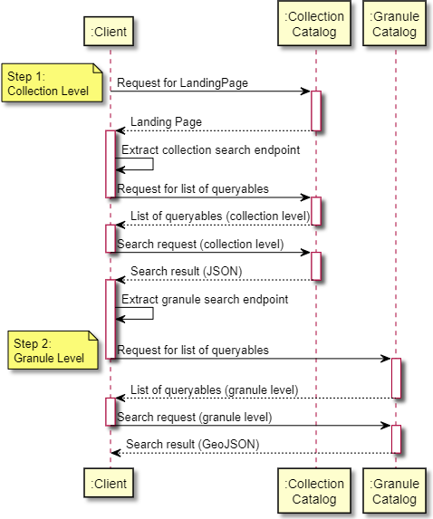

[Previous](granule-catalogs.md) | [Next](granule-metadata.md)
# 5. Collection Catalog Best Practices

[//]: # (this is a comment)

## 5.1 Overview

Explain main alternatives :
- static collection catalog (landing page, rel="child", rel="data", ..)
- collection catalog with search interface

The requirements in the current chapter only apply when TBD.

## 5.2 Collection catalog without search interface

EO collections represented as STAC collections can be made available as a STAC Catalog in different ways as depicted below:
- Through a hierarchy of catalogs or collections with the rel="child" relation.
- As a list of collections available via the rel="data" relation.

|  |
|:--:| 
| *Method 1: Using rel="child"* |

|  |
|:--:| 
| *Method 2: Using rel="data"* |

Implementations may combine both mechanisms and allow the same EO collection to be found via the collection hierarchy or the collection list.
Implementations intending to support collection search are to support at least Method 2 and the corresponding endpoint.

> **CEOS-STAC-REQ-510 - Collection access [Requirement]**<a name="BP-510"></a>
>
> A CEOS STAC catalog shall support access to collection metadata from the catalog landing page using the rel="child" or rel="data" approach depicted above or both approaches combined.

Note: When publishing a single collection, the collection and the landing page may be combined in a single JSON file.

## 5.3 Collection catalog with search interface


> **CEOS-STAC-REQ-520 - Collections endpoint [Requirement]**<a name="BP-520"></a>
>
> A CEOS STAC catalog supporting collection search shall advertise the search endpoint for collections in the landing page with rel="data" (most often `/collections`), type="application/json" and declare the corresponding collection search conformance classes in the landing page.  See "STAC API Collection Search" [[AD07]](./introduction.md#AD07).

The above endpoint is further referred to as the `collections endpoint`. 

.Conformance encoding example

```json
"conformsTo": [

    "http://www.opengis.net/spec/ogcapi_common-2/1.0/conf/collections",
    "http://www.opengis.net/spec/ogcapi-common-2/1.0/conf/simple-query",
    "http://www.opengis.net/spec/ogcapi-records-1/1.0/req/cql-filter",
    "https://api.stacspec.org/v1.0.0-rc.2/collection-search",
    "https://api.stacspec.org/v1.0.0-rc.2/collection-search#filter",
    "https://api.stacspec.org/v1.0.0-rc.1/collection-search#free-text",
    "http://www.opengis.net/spec/cql2/1.0/conf/cql2-text",
    "http://www.opengis.net/spec/cql2/1.0/conf/basic-cql2"
  ]
```

  

### 5.3.1 Collection search request

> **CEOS-STAC-REQ-530 - Collection search method [Requirement]**<a name="BP-530"></a>
>
> A CEOS STAC collection catalog shall support collection searches at the `collections endpoint` (rel="data") using the HTTP `GET` method.

#### Search parameters

> **CEOS-STAC-REQ-540 - Supported search parameters [Requirement]**<a name="BP-540"></a>
>
> The STAC-API and OGC API-Features specifications define a list of fundamental search parameters.  From these specifications, a CEOS STAC collection catalog shall support the following minimum set of search parameters for “collection” search at the collections endpoint:
- `limit`  
- `ids`
- `bbox` 
- `datetime`

> **CEOS-STAC-PER-550 - Intersects search parameter [Permission]**<a name="BP-550"></a>
>
> A CEOS STAC collection catalog may choose to not support the following search parameters for “collection” search at the collections endpoint:
- `intersects`

##### Free Text Keyword

> **CEOS-STAC-REC-560 - Free text search [Recommendation]**<a name="BP-0560"></a>
>
> For supporting free text searches, a CEOS STAC collection catalog shall advertise support for the HTTP query parameter `q` as in "STAC API Collection Search" [[AD07]](./introduction.md#AD07).


### 5.3.2 Collection search response

- optional list of collection search parameters (rel="http://www.opengis.net/def/rel/ogc/1.0/queryables", type="application/schema+json"
- search by 'id'  (at /collections), which 'ids' can be used for searching ?  'id' from hierarchy ?
- content negotiation (alternative formats)


> **CEOS-STAC-REQ-570 - Collection queryables [Requirement]**<a name="BP-570"></a>
>
> A CEOS STAC collection catalog supporting additional queryables for collection search shall return the link to the Queryables object with the list of queryables that can be used in a filter expression via a link object in the collection search response with rel="http://www.opengis.net/def/rel/ogc/1.0/queryables" and type="application/schema+json" (See also "STAC API Collection Search" [[AD07]](./introduction.md#AD07).


### 5.3.3 Two-step search

One serious hurdl"e to overcome in searching for data is the great number of data items to account
for in responses, as well as the expected number of successful “hits” for a query. In ordinary web
searches, the searcher is usually looking for a small number of web pages or documents.
Relevance ranking typically does a good job of presenting these successful hits near the top of
the returned list, followed by single point-and-click retrievals. However, when searching for Earth
science data covering large time periods or spatial areas, a user will often specify a set of
constraints to find an appropriate data collection together with space-time criteria for files within
that data collection. Often, the precision of the data collections returned for the search is low, with
many spurious hits. However, the space-time precision of the files is often quite high: that is, the
user truly wants to use all the data files of a desirable data collection set that fall within the spacetime region of interest. Thus, searching for all data satisfying both dataset content and space-time
region at the same time can produce a great many spurious hits, i.e., all the files for data
collections that are not desired.

> **CEOS-STAC-BP-001 - Support of two step search [Recommendation]**<a name="BP-001"></a>
> 
> Support for a two-step search consisting of a collection level search followed by a corresponding granule level search is recommended.

The two-step search consists of a collection level search and the subsequent granule level search
(or file-level search).

|  |
|:--:| 
| *Two Step Search* |

In order to provide a well-defined search path from a collection of interest to granules associated
with that collection, we advocate the use of two-step searching leveraging the following:

1. Link elements of relation items (rel=’items’) within collection entries. These links point
to a granule-level endpoint specific to the collection entry.
1. Link elements of relation queryables (rel=’queryables’) within collection entries. These links point
to available granule-level search parameters specific to the collection entry.
2. Granule level interface descriptions (i.e. endpoints and sets of search parameters) that can be tailored to a specific collection.

The advantages of this approach are as follows:

- A client can navigate from collection to granule with only an understanding of the STAC specification.
- A server links between collections and granules exploiting the relation between a STAC Collection and a STAC Item.
- It allows the client to determine what search parameters are available to the user at the
granule level using the /queryables response.


| ❓ | To be clarified what assumptions a STAC client is allowed to make regarding available (granule) search parameters.  Are STAC item-search parameters always all available at /search and /items endpoints, or only at the /search endpoint ?      |
|---------------|:------------------------|


| ❓ | What STAC collection ìdentifiers can be used to perform searches at the /search endpoint ?  All the ones available at the rel=`data` path, all the ones in the hierachical structure starting from the landing page following the rel=`child` links ? ?       |
|---------------|:------------------------|


| ❓ | What is the relation between the collections appearing in the hierarchy rel=`child` and the response from the /collections (rel=`data`) endpoint ?  One is a subset of the other or both can be unrelated ?   /collections to return a flat list ?  and how is it "filtered" when a query is applied ?  Flat list of all matches ?       |
|---------------|:------------------------|

