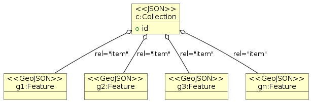
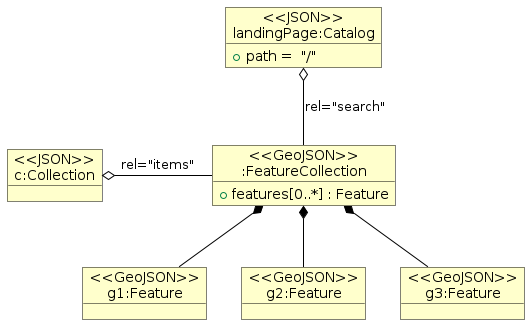

[Previous](best-practices.md) | [Table of contents](README.md) | [Next](collection-catalogs.md)
***
# 4 Granule Catalog Best Practices

[//]: # (this is a comment)

## 4.1 Overview

Explain main alternatives :
- static catalog (landing page, ..)
- catalog with search interface

## 4.2 Static catalog without search interface

- rel="item"

EO granules represented as STAC items can be made available as:
- individual STAC items referenced from a STAC collection
- the result of a search interface

|  |
|:--:| 
| *Method 1: Using rel="item"* |

|  |
|:--:| 
| *Method 2: Via a search interface* |

TBD: allow both ?

## 4.3 Catalog with search interface

### 4.3.1 Granule search request

#### Endpoints

> **CEOS-STAC-REQ-4310 - Granule search endpoints [Requirement]**
>
> CEOS STAC granule catalogs shall advertise and provide the endpoints for granule search per individual collection in the STAC Collection representation as a Link object with rel="items" and type="application/geo+json".

> **CEOS-STAC-PER-4320 - Cross-collection granule search endpoint [Permission]**
>
> CEOS STAC granule catalogs may or may not advertise and provide a cross-collection endpoint for granule search, valid for all the collections in the STAC Catalog (typically the Landing Page) with rel="search" and type="application/geo+json" and may instead only provide individual granule search endpoints per collection via rel="items" in the collection representation. 

The above permission avoids the implementation of multiple endpoints for granule search since a single implementation is sufficient.  CEOS STAC catalog clients should not assume the existence of the cross-collection granule search endpoint.

> **CEOS-STAC-REQ-4330 - Cross-collection granule search method [Requirement]**
>
> CEOS STAC granule catalogs with cross-collection granule search endpoint shall support searches at the `endpoint` (rel="search") using the HTTP `GET` method.

Support of the `POST` method at the cross-collection granule search endpoint (if available) is not required.

#### Search parameters

> **CEOS-STAC-REQ-4340 - Supported granule search parameters [Requirement]**
>
> The STAC-API and OGC API-Features specifications define a list of fundamental search parameters.  From these specifications, a CEOS STAC granule catalog shall support the following minimum set of search parameters for “granule” search at the rel="items" endpoint:
- `limit`  
- `bbox` 
- `datetime`

> **CEOS-STAC-REQ-4350 - Additional granule search queryables [Requirement]**
>
> A CEOS STAC granule catalog supporting additional queryables for a collection shall return the link to the Queryables object with the list of queryables that can be used in a filter expression for that collection via a link object in the collection representation (metadata) with rel="http://www.opengis.net/def/rel/ogc/1.0/queryables" and type="application/schema+json" (typically, but not necessarily, at '/collections/{collectionId}/queryables').

TBD: no requirements for cross-collection granule search endpoint if it is not required ?

#### Other

- Asset-level search capability (STFC)

### 4.3.2 Granule search response

> **CEOS-STAC-REQ-4630 - Item search response representation [Requirement]**
>
> A granule search response shall be represented as a GeoJSON FeatureCollection according to version v1.0.0 of the ["STAC API ItemCollection Specification"](https://github.com/radiantearth/stac-api-spec/blob/master/fragments/itemcollection/README.md).

> **CEOS-STAC-REQ-4635 - Allow for granule search-by-id [Requirement]**
>
> The $.features[].id property in a granule search response shall allow navigation to a single granule using the `id` as a path parameter appended to the granule search endpoint (rel='items') e.g. /collections/{collection-id}/items/{id}. 

> **CEOS-STAC-REQ-4640 - Item search response representation [Requirement]**
>
> Granules included in a granule search response shall be conformant with ["CEOS STAC Granule Metadata Best Practices"](granule-metadata.md).

| :question: | this is a question  |
|---------------|:------------------------|

| :memo:        | Take note of this       |
|---------------|:------------------------|

| :information_source: | Take note of this       |
|---------------|:------------------------|

| :warning:        | Take note of this       |
|---------------|:------------------------|
***
[Previous](best-practices.md) | [Table of contents](README.md) | [Next](collection-catalogs.md)